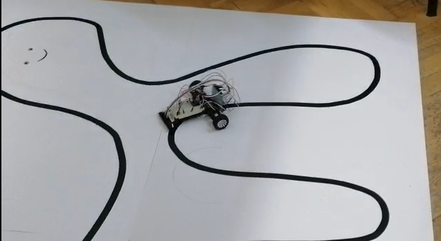

# Line Follower

- [Line Follower](#line-follower)
  - [About the team](#about-the-team)
  - [Task Requirements](#task-requirements)
  - [The line follower in action](#the-line-follower-in-action)
  - [PID Control Algorithm](#pid-control-algorithm)
  - [Challenges](#challenges)

The line follower robot is built using an Arduino microcontroller and the QTRSensors library. The robot is designed to follow a black line on a white surface and uses a PID control algorithm to adjust the speed of the two motors that drive the robot based on the position of the robot over the line.

## About the team

Members:
  * [Andrei Gatej](https://github.com/Andrei0872)
  * [Dragos Trandafir](https://github.com/nomoney34)

Team name: _PascalTeam_.

---

## Task Requirements

* a kit that contains the pieces required to build the line follower
* the robot should be calibrated before it starts following the line
* the robot should move at a fast speed

---

## The line follower in action

  

The video showcasing the functionality(or at least a part of it) can be found [here](https://youtube.com/shorts/NF3iMSwg8Gc?feature=share).

---

## PID Control Algorithm

The robot uses a PID control algorithm to adjust the speed of the motors based on the position of the robot over the line. The algorithm consists of three components:
- Proportional (P) - adjusts the motor speed based on the current error
- Integral (I) - adjusts the motor speed based on the accumulated error over time
- Derivative (D) - adjusts the motor speed based on the rate of change of the error

The algorithm takes the sensor readings and calculates the error, which is the difference between the current position of the robot and the ideal position (center of the line). The error is then used to adjust the motor speeds.

---

## Challenges

* trying to understand the _why_ behind the formula we've used for making the robot move properly(in the end, we weren't very successful)
* trying to make the calibration as accurate as possible(in the end, we went with a contrived approach that, honestly, could be called anything else but calibration)